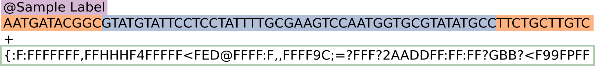
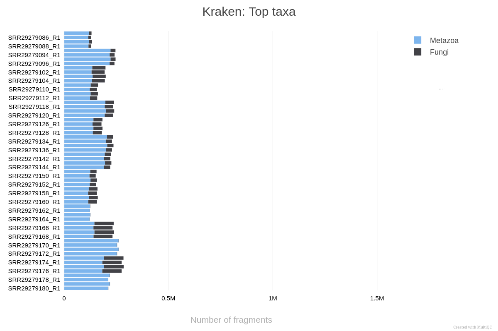

Esta seção do curso foca na preparação dos dados brutos. Como discutimos, em experimentos de interação patógeno-hospedeiro (como *Candida* em macrófagos), a maior parte das sequências obtidas pertencerá ao hospedeiro. O pré-processamento é a etapa onde garantimos que estamos analisando apenas o que nos interessa: o transcriptoma do patógeno.

---

# Pré-processamento e Descontaminação

Nesta etapa teórica, vamos entender como saímos das amostras biológicas para os arquivos de sequências limpas, prontos para a quantificação.

## 1. O Ciclo do Sequenciamento: Das Células às "Reads"

O processo começa com a extração do RNA total da amostra (macrófagos infectados). Esse RNA é convertido em cDNA e fragmentado para a construção de uma **biblioteca de sequenciamento**. 



As máquinas de sequenciamento (como as da Illumina) leem esses fragmentos e geram arquivos no formato **FASTQ**. Cada arquivo FASTQ contém milhões de sequências curtas chamadas **reads**, acompanhadas de índices de qualidade (Phred Score) para cada base identificada. No entanto, esses arquivos brutos contêm:

* Adaptadores de sequenciamento.
* Bases de baixa qualidade nas extremidades.
* **Contaminação do Hospedeiro:** Em modelos de infecção, até 95-99% das reads podem ser do hospedeiro (*Mus musculus*), mascarando o sinal da *Candida albicans*.

## 2. O Pipeline nf-core/detaxizer

Para resolver o problema da contaminação, utilizamos o pipeline [**nf-core/detaxizer**](https://nf-co.re/detaxizer/). Ele é projetado especificamente para verificar a presença de táxons específicos e filtrá-los de arquivos FASTQ.

O fluxo de trabalho do detaxizer segue estas etapas principais:

1.  **Controle de Qualidade (FastQC):** Avaliação inicial da qualidade das reads brutas.
2.  **Pré-processamento Opcional (fastp):** Corte de adaptadores e filtragem de reads por tamanho ou qualidade.
3.  **Classificação Taxonômica (Kraken2 e/ou bbduk):** As reads são comparadas contra bancos de dados genômicos para identificar sua origem. O **Kraken2** usa k-mers para uma atribuição rápida, enquanto o **bbduk** pode ser usado para pareamento direto contra sequências de referência.
4.  **Validação Opcional (BLASTN):** Para maior rigor, as reads classificadas podem ser validadas via alinhamento BLAST contra bancos de dados de nucleotídeos.
5.  **Filtragem:** O pipeline remove as reads associadas ao táxon indesejado (neste caso, *Mammalia*).
6.  **Relatório (MultiQC):** Consolida todos os resultados em um único arquivo HTML, permitindo visualizar quantas reads foram removidas e a qualidade final dos dados.

## 3. Automação com Nextflow

A execução de todas essas ferramentas manualmente seria propensa a erros e difícil de reproduzir. Para isso, utilizamos o [**Nextflow**](https://nextflow.io/), um motor de fluxo de trabalho que gerencia a instalação de ferramentas (via Docker/Singularity) e a execução paralela das tarefas.

::: {.callout-note}

## Ponto Importante

Para utilizar o Nextflow, é necessário ter o Java instalado e o comando `curl -s https://get.nextflow.io | bash`. O Nextflow organiza cada ferramenta em "processos" que são conectados em uma "pipeline".

:::

### O Script de Execução

Para o nosso conjunto de dados de *Candida* e macrófagos, o comando utilizado para a descontaminação foi:

```bash
nextflow run nf-core/detaxizer \
   -profile docker \
   --input samplesheet.csv \
   --preprocessing \
   --kraken2db db/k2_pluspf_20260226.tar.gz \
   --classification_kraken2_post_filtering \
   --filter_trimmed \
   --save_intermediates \
   --classification_bbduk \
   --classification_kraken2 \
   --tax2filter 'Mammalia' \
   --outdir results/decontaminated/
```

### Entendendo os Parâmetros:
* `-profile docker`: Garante que todas as ferramentas (Kraken2, FastQC, etc.) rodem dentro de containers, sem necessidade de instalação manual.
* `--tax2filter 'Mammalia'`: O ponto crucial. Instruímos o pipeline a identificar e remover tudo o que for classificado como mamífero (o hospedeiro *Mus musculus* e qualquer outra leitura humana).
* `--kraken2db`: Aponta para o banco de dados taxonômico usado para a identificação.
* `--filter_trimmed`: Aplica a filtragem nas reads já processadas pelo `fastp`.

### Recursos Esperados

* **Tempo Total:** 17 h 45 m 53 s
* **Tempo de CPU:** 35.2 h
* **Memória Máxima:** 104.7 GB

::: {.callout-tip}
Sobre o Banco de Dados Kraken2 (PlusPF)

O banco de dados utilizado, k2_pluspf, é a versão Standard plus Refseq protozoa & fungi. Ele contém o genoma humano, genomas de bactérias, archaea, vírus e, crucialmente para este curso, o RefSeq de protozoários e fungos.

Isso é fundamental porque, para filtrar o que é Mammalia com segurança, o software precisa saber diferenciar o que é hospedeiro do que é patógeno. Sem as sequências de fungos no banco, o Kraken2 poderia classificar erroneamente reads da Candida como sendo de origem desconhecida ou até atribuí-las falsamente a outros grupos. Para mais informações sobre as referências do Kraken2, consulte <https://benlangmead.github.io/aws-indexes/k2>
:::

Ao final deste processo, obtemos arquivos FASTQ "limpos", contendo predominantemente sequências da *Candida albicans*, prontos para a próxima etapa: a **Quantificação**.

::: {.callout-note}

## Ponto Importante

Uma estratégia igualmente válida seria remover as leituras de *Fungi* e analisar a partir das leituras removidas ao invés das filtradas. Talvez um de vocês possa tentar isso depois!
:::

## Visualizando a Composição Taxonômica (Kraken2)

Para avaliar a eficiência da nossa estratégia de descontaminação e entender a composição das nossas amostras brutas, analisamos a distribuição taxonômica das reads antes da filtragem. O gráfico abaixo, gerado pelo MultiQC, resume os principais táxons identificados pelo Kraken2.



Como interpretar este gráfico:

- Predomínio de Metazoa (Azul): Como esperado em um modelo de infecção de macrófagos, a grande maioria dos fragmentos é classificada como Metazoa (neste caso, representando o hospedeiro, Mus musculus). Isso ilustra o desafio da "contaminação do hospedeiro": o sinal do camundongo é ordens de grandeza maior que o do patógeno.

- O Nosso Alvo - Fungi (Cinza Escuro): Os segmentos em cinza escuro representam o reino Fungi, especificamente a Candida albicans. Observe que a proporção de reads fúngicas varia entre as amostras.

::: {.callout-tip}
Por que isso é importante?

Ao utilizarmos o pipeline nf-core/detaxizer com o parâmetro --tax2filter 'Mammalia', estamos essencialmente "removendo" a parte azul dessas barras e mantendo apenas a parte cinza escuro. Isso garante que, na etapa de Quantificação, o software não perca tempo processando sequências do hospedeiro que não nos interessam para este estudo específico do patógeno.
:::

---

**Com os dados descontaminados, como podemos saber exatamente quantos genes da *Candida* estão presentes em cada amostra? Veremos isso na próxima seção sobre o nf-core/rnaseq.**