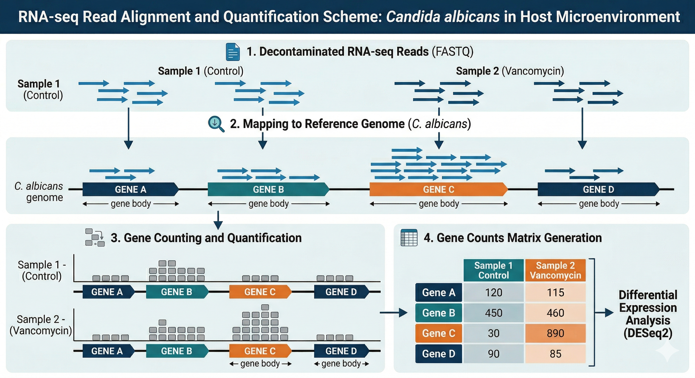

Com os dados descontaminados, o próximo passo é identificar a quais genes da *Candida albicans* essas sequências pertencem e contar quantas vezes cada gene aparece em nossas amostras. Este processo é conhecido como **Quantificação**.

## 1. Alinhamento e Quantificação

O processo de quantificação geralmente envolve duas etapas principais:

1.  **Alinhamento (Mapping):** As reads (sequências curtas) são comparadas contra um genoma de referência ou transcriptoma. É como montar um quebra-cabeça onde usamos o genoma como o guia para saber de onde cada peça veio.
2.  **Contagem (Counting):** Uma vez que sabemos onde a read se encaixa, verificamos se ela caiu em uma região anotada como um "gene". O resultado final é uma **Matriz de Contagens**, onde cada linha é um gene e cada coluna é uma amostra.



## 2. O Pipeline nf-core/rnaseq

Para esta etapa, utilizamos o [**nf-core/rnaseq**](https://nf-co.re/rnaseq), um dos pipelines mais robustos e utilizados no mundo para análise de transcriptômica. Ele automatiza desde o controle de qualidade final até a geração das matrizes de expressão.

### O Script de Execução

O comando utilizado para quantificar o transcriptoma da *Candida albicans* foi:

```bash
nextflow run nf-core/rnaseq \
    --input rnaseq_samplesheet.csv \
    --outdir rnaseq_results \
    --gtf db/Candida_albicans.GCA000182965v3.62.gtf.gz \
    --fasta db/Candida_albicans.GCA000182965v3.dna.toplevel.fa.gz \
    -profile docker \
    -resume -with-tower
```

### Entendendo os Parâmetros:

  * `--fasta`: O arquivo de sequência genômica (o "dicionário" de DNA) da *Candida*.
  * `--gtf`: O arquivo de anotação, que diz ao software as coordenadas exatas de onde cada gene começa e termina no genoma.
  * `-with-tower`: Permite o monitoramento remoto da execução via [Nextflow Tower](https://tower.nf/).

## 3\. Fontes de Dados: Ensembl Fungi

Para organismos não-modelos ou patógenos fúngicos, a fonte para genomas e anotações é o [**Ensembl Fungi**](https://fungi.ensembl.org/).

Para este curso, utilizamos a linhagem de referência **SC5314** da *Candida albicans*. As referências foram adquiridas nos seguintes links:

  * **Genoma (Fasta):** [C. albicans DNA Toplevel](https://fungi.ensembl.org/Candida_albicans_sc5314_gca_000784655/Info/Index)
  * **Anotação (GTF):** [C. albicans Gene Annotation](https://fungi.ensembl.org/Candida_albicans_sc5314_gca_000784655/Info/Index)

::: {.callout-important}

## Por que usar o Ensembl Fungi?

Diferente do Ensembl principal (focado em vertebrados), o Ensembl Fungi mantém curadoria específica para as complexidades de genomas fúngicos, como estruturas de íntrons compactas e polimorfismos frequentes, garantindo que a nossa quantificação seja a mais precisa possível.
:::

### 4. Entendendo os Outputs: Do Transcrito ao Gene à Proteína

Antes de abrirmos o R para a Análise de Expressão Diferencial, precisamos alinhar exatamente o que o RNA-Seq mede e como isso se conecta com o resto do curso. 

Lembrando o dogma central da biologia molecular (**DNA → RNA → Proteína**), nosso dado é um "snapshot" do **transcriptoma** (RNA). O Salmon quantifica **transcritos** (mRNA), mas nas próximas etapas falaremos constantemente em **genes** e **proteínas**. Por que essa mudança de termos?

* **Dos Transcritos aos Genes:** Um único gene pode gerar múltiplos transcritos (isoformas) por *splicing* alternativo. Para simplificar a análise, especialmente no genoma mais compacto da *Candida albicans*, o padrão é **somar as contagens das isoformas em um único valor por gene**. O pipeline *nf-core/rnaseq* já fez isso para nós e gerou o arquivo que usaremos: `salmon.merged.gene_counts.tsv`.
* **Dos Genes às Proteínas:** No final da nossa análise, usaremos esses genes para mapear vias biológicas e redes de interação (PPI).

::: {.callout-note}
## Atenção aos Termos
Na literatura, é muito comum ler "o gene X está superexpresso" ou "a proteína Y alterou" em estudos de RNA-Seq. Na prática, nós medimos apenas a **abundância de transcritos** e a usamos como um *proxy* (uma estimativa) da atividade do gene e da futura tradução proteica. Seguiremos essa mesma convenção prática ao longo do curso.
:::

---

**Com a nossa matriz de contagens pronta e os conceitos alinhados, vamos abrir o R. A grande pergunta agora é: quais genes alteraram sua expressão devido ao tratamento com vancomicina? É o que vamos descobrir a seguir usando o DESeq2.**